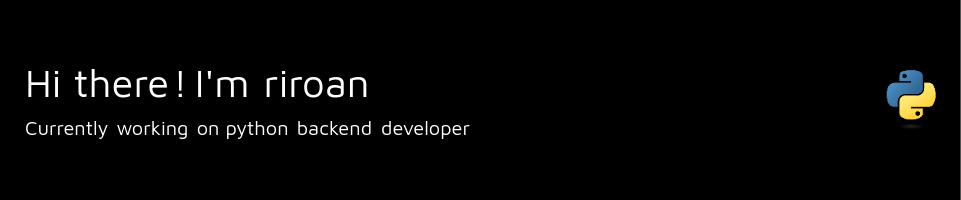

<!-- ### 👯 <a href="https://drive.google.com/file/d/1NR2jyKIKGph178ernL4MCQEqvbN55MPc/view?usp=sharing">About Me</a> -->

### :books: My Skill Set

### :rainbow: Contact with me
<code></code>
<code></code>
<code></code>
<code></code>
<code></code>
<code></code>

### :page_with_curl: My latest posts

<a href=https://riroan.tistory.com/171>[수학] Online Math Contest</a> (24.02.17) <a href=https://riroan.tistory.com/170>[알고리즘] 알고리즘(PS)이 개발에 미치는 영향</a> (24.02.05) <a href=https://riroan.tistory.com/169>[알고리즘] solved.ac Grand Arena Party onsite (Arena #18) 후기</a> (24.02.03) <a href=https://riroan.tistory.com/168>[알고리즘] 덱 (deque)</a> (24.01.02) <a href=https://riroan.tistory.com/167>2023년을 되돌아보며</a> (23.12.31) 

### ⚡ etc

